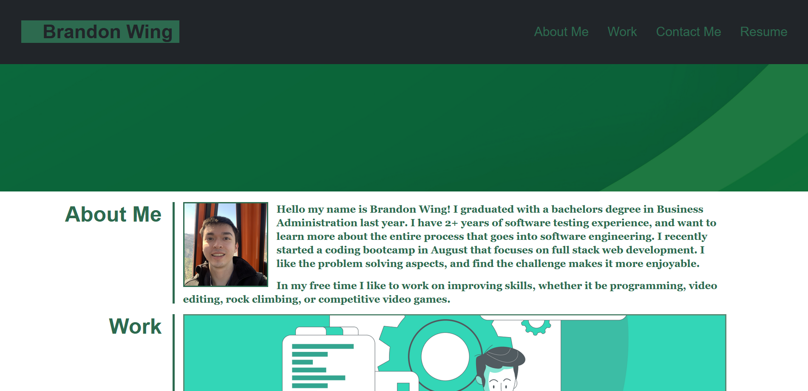
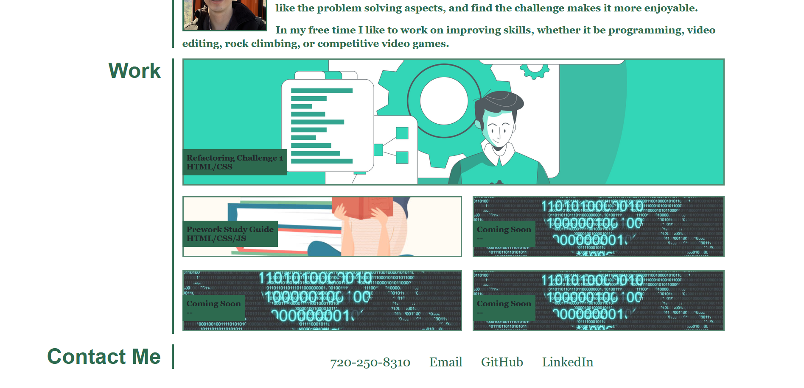
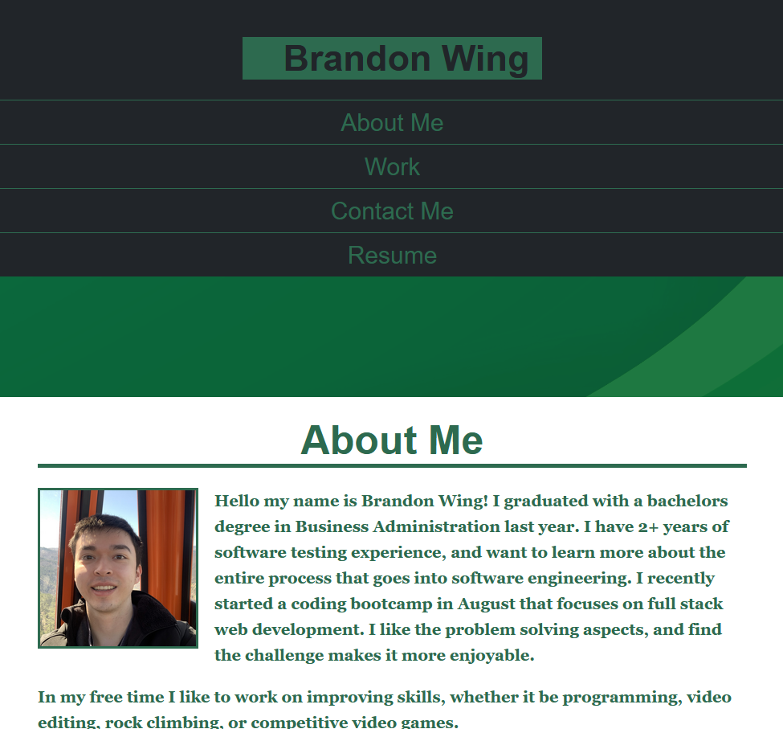
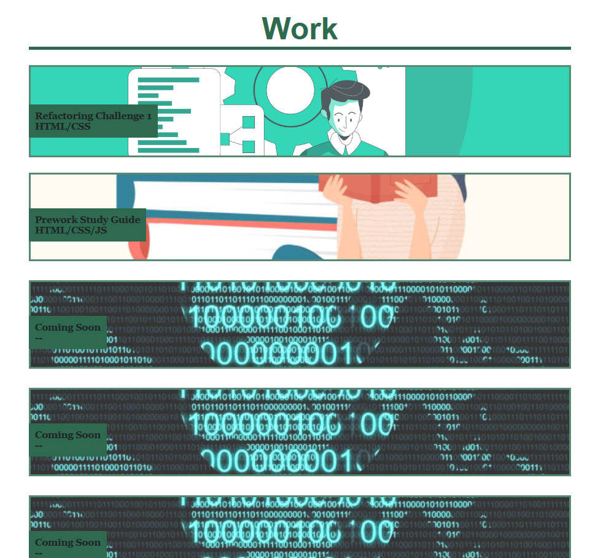
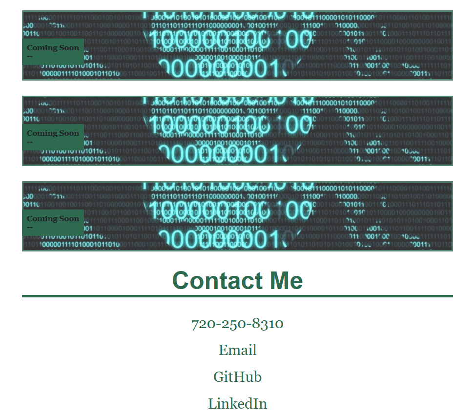
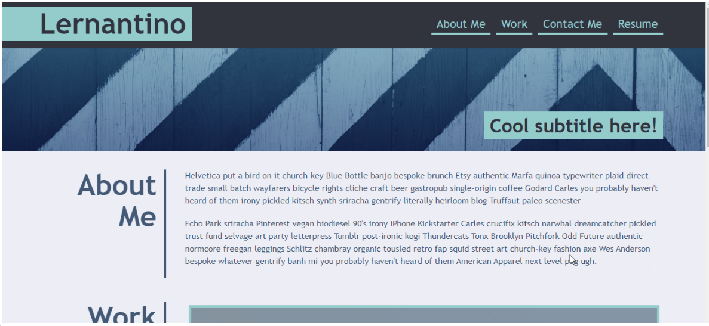
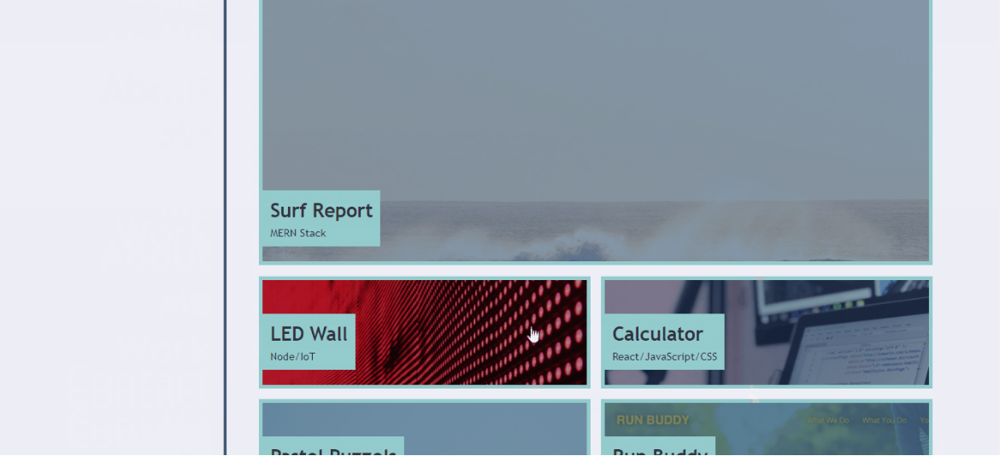
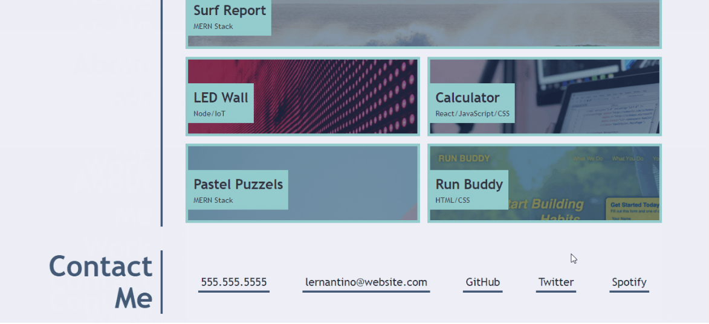

# Professional Portfolio Website

[Live deploy link](https://bwing2.github.io/professional-portfolio-challenge-2/)

## Description

For my professional portfolio website I tried to emulate the mock up example as a challenge. But I wanted to add my own personal style to it. This is the first responsive website page I have made, and I tried to make the code as structured and easy to read as possible. All future adjustments to the website should be easier as a result.

My biggest challenge was using the grid layout, and how that affects image placement. I gained an understanding about background-size, background-position, and object-fit properties which all manipulate images in different ways. Another challenge was having my layout change from desktop to mobile screen size. Learning how to incorporate these elements into my portfolio has taught me a lot about responsive elements, and how to research issues I come across in the future. 

## Usage

### Desktop View

### Mobile View (Max-Width: 1110px)

### Example Desktop View

## License

MIT License

Copyright (c) 2023 Brandon Wing

Permission is hereby granted, free of charge, to any person obtaining a copy
of this software and associated documentation files (the "Software"), to deal
in the Software without restriction, including without limitation the rights
to use, copy, modify, merge, publish, distribute, sublicense, and/or sell
copies of the Software, and to permit persons to whom the Software is
furnished to do so, subject to the following conditions:

The above copyright notice and this permission notice shall be included in all
copies or substantial portions of the Software.

THE SOFTWARE IS PROVIDED "AS IS", WITHOUT WARRANTY OF ANY KIND, EXPRESS OR
IMPLIED, INCLUDING BUT NOT LIMITED TO THE WARRANTIES OF MERCHANTABILITY,
FITNESS FOR A PARTICULAR PURPOSE AND NONINFRINGEMENT. IN NO EVENT SHALL THE
AUTHORS OR COPYRIGHT HOLDERS BE LIABLE FOR ANY CLAIM, DAMAGES OR OTHER
LIABILITY, WHETHER IN AN ACTION OF CONTRACT, TORT OR OTHERWISE, ARISING FROM,
OUT OF OR IN CONNECTION WITH THE SOFTWARE OR THE USE OR OTHER DEALINGS IN THE
SOFTWARE.
